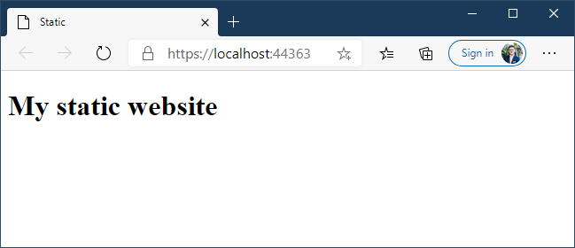

# Static website ASPCore template
In Azure you can cheaply host a website inside a storage account. The only limitation you have is that it must be a static website, decide for yourself whether that is an issue or not.

A static website is only a set of files inside the $web container. This is great, however in Visual Studio I haven't found an easy to way to create static website and how to 'host' them. This is were an ASP Core website comes in. 

## ASPCore website template
- For this lets create an new ASP.NET Core Web Application. 
- Take the 'Empty' template as type.
- Delete the following file:
    - appsettings.Development.json
    - appsettings.json
    - Startup.cs
- Replace the Program.cs file with the following content:
```csharp
using Microsoft.AspNetCore.Builder;
using Microsoft.AspNetCore.Hosting;
using Microsoft.Extensions.Hosting;

namespace StaticSite
{
    public static class Program
    {
        public static void Main(string[] args)
        {
            Host.CreateDefaultBuilder()
                .ConfigureWebHostDefaults(webBuilder =>
                {
                    webBuilder.Configure(configureApp =>
                    {
                        configureApp.UseFileServer();
                    });
                })
                .Build()
                .Run();
        }
    }
}
```
- Add a folder named: `wwwroot`
- Add a `html` file to the `wwwroot` folder with the content:
```html
<!DOCTYPE html>
<html>
<head>
    <meta charset="utf-8" />
    <title>Static</title>
</head>
<body>
    <h1>My static website</h1>
</body>
</html>
```
- Start (F5 in C# settings) the website.

When everything is setup correctly you will see:


## Publish website

T.B.C